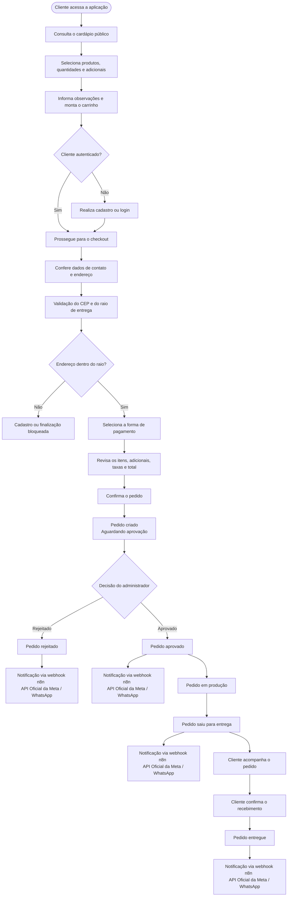
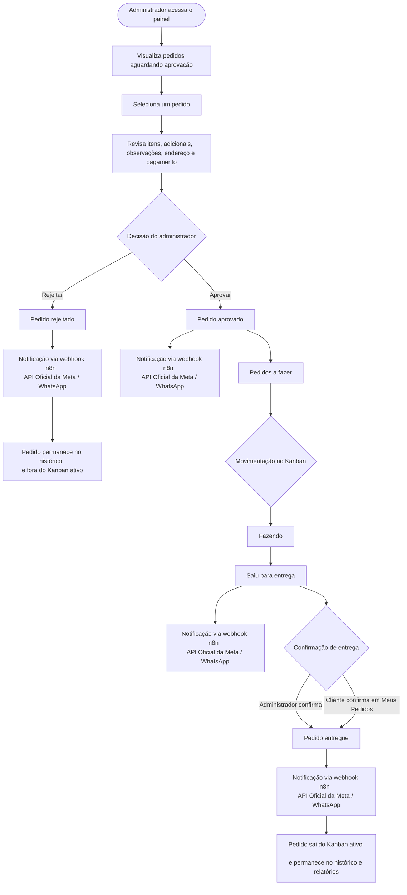
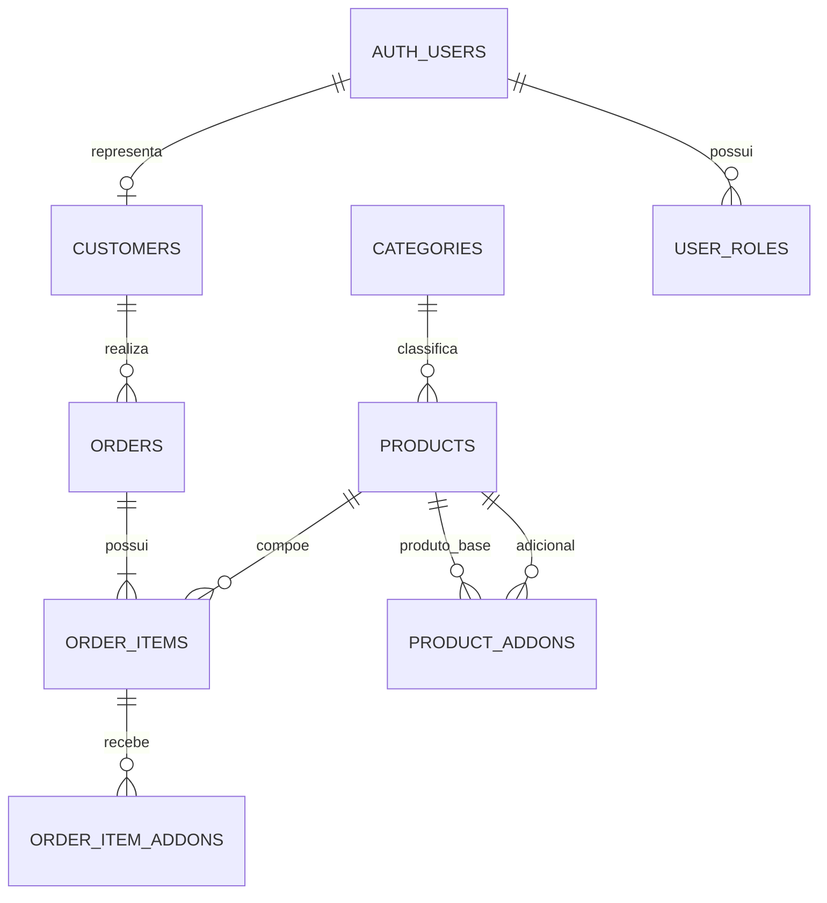

# 🛵 DeliveryPro

> Plataforma web full-stack para gerenciamento do ciclo completo de pedidos de delivery, desde a montagem do carrinho pelo cliente até a confirmação da entrega, com operação administrativa em Kanban, validação geográfica de entrega, relatórios e notificações automáticas via WhatsApp.

[](#)
[](#)
[](#)
[](#)
[](#)
[](#)
[](#)

---

## 📋 Sobre o projeto

O **DeliveryPro** é uma aplicação web de pedidos para delivery desenvolvida para atender a operação de uma loja única. A plataforma cobre as principais etapas do negócio: apresentação do cardápio, configuração de produtos e adicionais, cadastro de clientes, montagem do carrinho, checkout, aprovação de pedidos, acompanhamento da produção, confirmação de recebimento, notificações automáticas e relatórios gerenciais.

O sistema possui duas áreas principais. A área pública permite que visitantes naveguem pelo cardápio e montem seus carrinhos. A área administrativa oferece recursos para gerenciar produtos, pedidos, configurações de entrega, administradores e indicadores operacionais.

O projeto foi desenvolvido de forma incremental com apoio do **Lovable**, utilizando o **Supabase** como backend gerenciado e o **n8n** como orquestrador das notificações enviadas por WhatsApp.

## 🌐 Acesso à aplicação

A aplicação está disponível em:

**https://app-deliverypro.lovable.app/**

> A Fase 1 do DeliveryPro foi concluída e disponibiliza o fluxo principal de pedidos, gerenciamento administrativo, acompanhamento por Kanban, validação de entrega, relatórios e notificações via WhatsApp. O projeto terá continuidade na Fase 2, que contemplará novas melhorias e evoluções.

## 🏁 Objetivo

O objetivo do DeliveryPro é centralizar o recebimento e o acompanhamento de pedidos de uma loja de delivery em um único fluxo digital.

O sistema permite que o cliente monte o pedido, informe seus dados, selecione a forma de pagamento e acompanhe a evolução da entrega. Para o administrador, a plataforma oferece controle sobre o cardápio, aprovação dos pedidos, produção, entrega, configurações operacionais e resultados do negócio.

A solução foi projetada para reduzir atividades manuais, organizar o fluxo de produção e manter o cliente informado nos principais marcos do pedido.

## 💡 Problema de negócio

Em uma operação de delivery, o recebimento de pedidos, a conferência dos itens, a comunicação com o cliente e o controle da produção podem ficar dispersos entre diferentes canais e controles manuais.

Esse cenário pode causar problemas como:

- pedidos recebidos sem validação adequada da área de entrega;
- dificuldade para acompanhar o status de cada pedido;
- falhas na comunicação sobre aprovação e saída para entrega;
- inconsistência entre o preço atual do produto e o preço praticado no momento da compra;
- falta de histórico de pedidos por cliente;
- ausência de indicadores consolidados para acompanhamento da operação.

O DeliveryPro foi desenvolvido para organizar essas etapas em uma aplicação integrada, com regras de negócio aplicadas tanto na interface quanto no banco de dados.

## 🛠️ Solução proposta

O DeliveryPro transforma o pedido de delivery em um fluxo controlado:

## Fluxo do cliente
O fluxo abaixo representa a jornada do cliente desde o acesso ao cardápio até a confirmação do recebimento. A decisão de aprovar ou rejeitar pertence ao administrador, mas aparece no fluxo porque altera diretamente a experiência do cliente.


## Fluxo do administrador
O administrador utiliza o painel administrativo para controlar o ciclo operacional dos pedidos. A partir da área de aprovação, ele revisa os dados do pedido, verifica os itens, adicionais, observações, forma de pagamento e endereço de entrega antes de decidir se o pedido será aceito ou rejeitado.

Quando o pedido é aprovado, ele entra no quadro Kanban e pode ser movimentado entre as etapas de produção por meio de arrastar e soltar. Quando é rejeitado, permanece fora do Kanban ativo e o cliente recebe uma notificação específica.

O administrador também pode acompanhar pedidos em tempo real, atualizar o status da produção, confirmar a saída para entrega e concluir o pedido como entregue. A confirmação de entrega também pode ser realizada pelo cliente na área Meus Pedidos.



## ✨ Principais funcionalidades
### 1. Landing Page
A Landing Page é a porta de entrada do DeliveryPro. Ela apresenta a proposta da aplicação e orienta o visitante a iniciar um pedido.
O destaque principal informa que o sistema oferece hambúrgueres, pizzas e outros produtos preparados na hora e entregues ao cliente. A página também reforça a possibilidade de montar o pedido de acordo com a preferência do cliente e acompanhar sua evolução desde o preparo até a entrega.

A seção “Por que pedir com a gente?” apresenta os principais benefícios da solução:
- Cardápio digital: permite montar o pedido diretamente pelo navegador, incluindo os adicionais disponíveis;
- Pagamento na entrega: possibilita escolher entre crédito, débito ou Pix e realizar o pagamento quando o pedido chegar;
- Confirmação por WhatsApp: informa o cliente quando o pedido é aprovado e quando sai para entrega;
- Ingredientes frescos: destaca a preparação dos produtos no momento do pedido.

A página disponibiliza botões de chamada para ação, como “Ver Cardápio” e “Começar Pedido”, direcionando o visitante para o fluxo de seleção dos produtos.

### 📸 Screenshot


### 2. Cadastro, login e recuperação de senha

Clientes e administradores utilizam a mesma tela de entrada. Após a autenticação, o sistema identifica o papel da conta e direciona o usuário para a área correspondente.

O cadastro público de clientes solicita:

- nome completo;
- e-mail;
- telefone/WhatsApp;
- CEP;
- número e complemento do endereço;
- senha e confirmação de senha.

> Durante o cadastro, o cliente informa o CEP e o sistema consulta a BrasilAPI para obter os dados de endereço correspondentes. As informações de rua, bairro, cidade e estado são preenchidas automaticamente com base no retorno da API, enquanto o cliente precisa informar manualmente o número e o complemento do endereço.

O cadastro de administrador não é público. Uma conta de cliente existente só pode ser promovida ou ter o papel administrativo revogado por um administrador autorizado.

A aplicação também possui fluxo de recuperação de senha com uma rota para solicitação e outra para definição da nova senha.

### 📸 Screenshot


### 3. Cardápio público

O cardápio pode ser acessado sem autenticação e apresenta os produtos organizados por categorias cadastradas pelo administrador.

Cada produto pode possuir nome, descrição, preço, foto, categoria e informações de disponibilidade. O sistema também permite exibir um único emblema por produto, seguindo a prioridade **Promoção**, **Popular** e **Novo**.

Os produtos de cada categoria são apresentados em carrosséis horizontais. O comportamento inclui navegação por setas, suporte a arrastar em dispositivos móveis e indicação visual da existência de outros produtos. Quando todos os produtos cabem no espaço disponível, o carrossel não é exibido.

### 📸 Screenshot


### 4. Montagem do Pedido e Carrinho

O cliente pode adicionar produtos ao carrinho, definir quantidades, escolher adicionais e informar observações livres para cada item.

O carrinho permanece em memória durante a sessão até a confirmação do pedido. A seleção de adicionais respeita os vínculos cadastrados entre o produto-base e seus modificadores.


### 5. Checkout ( Revisar pedido )

A finalização do pedido exige autenticação. O sistema não permite concluir um pedido como convidado.

Durante o checkout, os dados de nome, telefone e endereço são pré-preenchidos a partir da conta do cliente. Eles podem ser ajustados para o pedido atual sem alterar o cadastro permanente.

O cliente deve selecionar uma forma de pagamento entre:

- cartão de crédito;
- cartão de débito;
- Pix.

O pagamento é realizado na entrega. A aplicação não processa cobranças online.

A tela de revisão apresenta a foto de cada produto, os adicionais, as observações, a taxa de entrega e o total do pedido. Após a confirmação, o pedido recebe um número sequencial legível e inicia com o status **aguardando aprovação**.

### 📸 Screenshot


### 6. Meus pedidos e confirmação de recebimento

O cliente autenticado possui acesso à área **Meus Pedidos**, que lista exclusivamente seus próprios pedidos, com os registros mais recentes primeiro.

Cada registro apresenta o número do pedido, a imagem do produto principal e um indicador de status utilizando a mesma paleta visual do Kanban administrativo.

Quando o pedido está em **saiu para entrega**, o cliente pode confirmar o recebimento. Essa é a única alteração de status permitida diretamente pelo cliente. A transição autorizada é:

```text
saiu_para_entrega → entregue
```

Qualquer tentativa de alterar outro campo ou executar uma transição diferente é rejeitada pelo banco de dados.

### 📸 Screenshot


## 7. 🛠️ Painel Admistrativo

### 7.1 Relatórios gerenciais

A sessão de relatórios apresenta indicadores filtráveis por período, incluindo:

- total de pedidos;
- receita bruta;
- ticket médio;
- pedidos por dia;
- distribuição por status;
- ranking de produtos mais vendidos;
- ranking de adicionais mais vendidos.

Os contadores de status são atualizados em tempo real e funcionam de forma independente do filtro de período. Esse comportamento utiliza o recurso Realtime do Supabase com assinatura na tabela de pedidos.

Os detalhes dos pedidos podem ser exportados nos formatos **XLSX** e **CSV**.

### 📸 Screenshot


### 7.2 Produtos, categorias e adicionais ((((((((((((( REVER TEXTO )))))))))))))

O administrador pode cadastrar e editar produtos e categorias. Um produto pode ser desativado sem ser excluído, preservando sua utilização no histórico de pedidos.

Os adicionais são tratados como modificadores vinculados a produtos específicos. Dessa forma, um adicional não é vendido de forma independente: ele pode ser selecionado somente quando estiver associado ao produto-base correspondente.

O preço do produto deve ser maior que zero. Essa regra é validada na interface e reforçada pela restrição `CHECK (price > 0)` no banco de dados.

### 📸 Screenshot

COLOCAR LINK

### 7.3 Aprovação e produção em Kanban

Um pedido recém-criado não entra diretamente em produção. Ele permanece aguardando a decisão do administrador.

Após a aprovação, o pedido passa para o quadro Kanban administrativo. O quadro possui três etapas operacionais principais, com cartões reordenáveis por arrastar e soltar:

- **Pedidos a fazer**;
- **Fazendo**;
- **Saiu para entrega**.

A área de pedidos aguardando aprovação possui identificação visual própria. Cada etapa utiliza cor e ícone distintos para facilitar a leitura rápida do quadro.

Cada cartão exibe o número do pedido, o nome do cliente e um resumo dos itens. O administrador pode rejeitar pedidos ainda pendentes ou movimentar pedidos aprovados durante a produção.

O ciclo operacional é encerrado no status **entregue**. O pedido deixa o Kanban ativo, mas permanece disponível no histórico do cliente e nos relatórios administrativos.

### 📸 Screenshot


### 7.4 Configuração

- Validação de endereço e área de entrega

O administrador configura o CEP da loja, a taxa de entrega, a opção de frete grátis e o raio máximo de atendimento em quilômetros. No cadastro do cliente, o sistema calcula a distância entre a loja e o endereço informado.

A aplicação utiliza a **BrasilAPI** para consultar o CEP e obter dados de endereço e coordenadas geográficas.

Quando a distância supera o raio configurado, o cadastro é bloqueado e a interface informa a distância calculada e o limite permitido.

- Gestão de administradores

Um administrador pode localizar uma conta de cliente já cadastrada e conceder a ela o papel administrativo. O mesmo recurso permite revogar esse papel.

O sistema impede a remoção do último administrador restante, preservando a possibilidade de gerenciamento do painel.

### 📸 Screenshot


## 📱 Notificações via WhatsApp

O sistema envia notificações automáticas em três momentos do ciclo do pedido:

1. aprovação do pedido;
2. saída do pedido para entrega;
3. confirmação da entrega.

O disparo é realizado por um gatilho do PostgreSQL após a atualização do pedido. A extensão `pg_net` faz a chamada HTTP para o webhook configurado do n8n. Dessa forma, o envio não depende de uma sessão de navegador aberta pelo administrador.

O aplicativo envia ao n8n um payload estruturado contendo:

- evento ocorrido;
- número do pedido;
- nome do cliente;
- telefone em formato internacional;
- total;
- forma de pagamento legível;
- observações;
- resumo dos itens;
- resumo dos adicionais.

O n8n é responsável por construir o texto final e realizar o envio da mensagem via WhatsApp. O disparo é assíncrono e best-effort. Na versão atual, não existe retentativa automática nem alerta visual de falha na aplicação.

## 🖧 Arquitetura da solução

O DeliveryPro utiliza uma arquitetura web com frontend hospedado na plataforma Lovable e backend gerenciado pelo Supabase.

```text
                                 ┌────────────────────────────┐ 
                                 │           Cliente          │
                                 │  Navegador desktop/mobile  │
                                 └──────────────┬─────────────┘
                                                │
                                                ▼
                                 ┌────────────────────────────┐
                                 │        Interface Web       │
                                 │  React + TypeScript + Vite │
                                 │  Tailwind CSS + shadcn/ui  │
                                 └──────────────┬─────────────┘
                                                │
                                                ▼
                        ┌──────────────────────────────────────────────┐
                        │                  Supabase                    │
                        │ Auth | PostgreSQL | RLS | Realtime | Storage │
                        │                                              │
                        └───────────────────────┬──────────────────────┘
                                                │
                                   ┌────────────┴───────────┐
                                   ▼                        ▼
                        ┌─────────────────────┐  ┌─────────────────────┐
                        │       BrasilAPI     │  │ PostgreSQL + pg_net │
                        │     CEP e geocod.   │  │  Gatilho de webhook │
                        └─────────────────────┘  └──────────┬──────────┘
                                                            ▼
                                                 ┌─────────────────────┐
                                                 │         n8n         │
                                                 │    WhatsApp webhook │
                                                 └─────────────────────┘
```

### Camadas principais

**Frontend.** Responsável pela interface pública, autenticação, cardápio, carrinho, checkout, área do cliente e painel administrativo. A interface foi construída com React e TypeScript, utilizando Vite para desenvolvimento e build, Tailwind CSS para estilização e shadcn/ui como biblioteca de componentes baseada em Radix UI.

**Autenticação.** O Supabase Auth gerencia cadastro, login, sessão e recuperação de senha.

**Dados e regras.** O PostgreSQL armazena produtos, categorias, clientes, pedidos, itens, adicionais, configurações de entrega e papéis de usuário. As regras críticas são reforçadas no banco por constraints, políticas de RLS e funções protegidas.

**Atualizações em tempo real.** O Supabase Realtime atualiza os contadores de status exibidos nos relatórios administrativos.

**Armazenamento.** O Supabase Storage mantém as fotos dos produtos em bucket privado. A aplicação gera URLs assinadas dinamicamente durante o carregamento.

**Integrações.** A BrasilAPI fornece dados de CEP e coordenadas. O n8n recebe os eventos de pedidos por webhook e realiza o envio das mensagens de WhatsApp.

## Modelo de dados

O banco de dados utiliza PostgreSQL por meio do Supabase.

| Entidade | Responsabilidade |
|---|---|
| `products` | Armazena produtos, preços, fotos, categorias, disponibilidade e indicação de adicional. |
| `categories` | Armazena as categorias livremente cadastradas para o cardápio. |
| `product_addons` | Relaciona produtos-base aos adicionais permitidos. |
| `customers` | Armazena os dados cadastrais e o endereço dos clientes. |
| `orders` | Armazena pedidos, status, valores, pagamento e datas do ciclo operacional. |
| `order_items` | Armazena os produtos incluídos em cada pedido e seus preços no momento da compra. |
| `order_item_addons` | Armazena os adicionais selecionados em cada item do pedido. |
| `delivery_settings` | Armazena as configurações de entrega da loja em uma tabela de linha única. |
| `delivery_webhook` | Armazena o endereço webhook do n8n para disparo das mensagens whatsapp.|
| `user_roles` | Armazena os papéis administrativos associados às contas autenticadas. |

## Relacionamentos principais



O preço unitário do produto e dos adicionais é copiado para as tabelas do pedido no momento da compra. Essa decisão preserva o valor histórico mesmo quando o preço do cadastro do produto é alterado posteriormente.

## Segurança e controle de acesso

A segurança dos dados é baseada no Supabase Auth, em políticas de **Row Level Security (RLS)** e em funções protegidas no PostgreSQL.

## Modelo de papéis

Os papéis administrativos são mantidos em uma tabela dedicada chamada `user_roles`. A função `has_role(user_id, role)` utiliza `SECURITY DEFINER` e possui `search_path` explícito. Esse isolamento evita recursão quando as políticas de RLS consultam a existência de um papel administrativo.

## Isolamento por usuário

Clientes autenticados podem consultar apenas seus próprios pedidos e dados permitidos. Administradores possuem acesso operacional às entidades necessárias para gerenciar a loja.

Produtos ativos e categorias podem ser consultados publicamente para exibição do cardápio. Dados sensíveis de clientes e pedidos não ficam disponíveis de forma irrestrita para usuários anônimos.

## Proteção das alterações de pedido

A função `guard_customer_order_update` é executada antes das alterações em `orders` e aplica as seguintes regras:

1. administradores podem operar os pedidos conforme suas permissões;
2. o cliente só pode alterar um pedido pertencente à própria conta;
3. a única transição permitida ao cliente é `saiu_para_entrega` para `entregue`;
4. a linha é reconstruída a partir do estado anterior, permitindo a alteração somente de `status` e `delivered_at`.

Com isso, uma requisição direta à API não consegue modificar preço, cliente, total, pagamento ou outros campos protegidos.

## Credenciais e endpoints

A URL do webhook n8n é armazenada como dado em `delivery_settings.n8n_webhook_url`, e não como valor fixo em arquivos de migração versionados.

O arquivo `.env` não deve ser versionado. O projeto utiliza `.env.example` para documentar os nomes das variáveis sem incluir valores reais.

As variáveis client-side do Supabase são públicas por natureza e não substituem o controle de acesso. A proteção efetiva é realizada pelas políticas de RLS e pelas regras do banco.

## Integrações externas

### Supabase

O Supabase fornece:

- autenticação de clientes e administradores;
- banco de dados PostgreSQL;
- Row Level Security;
- atualizações em tempo real com Realtime;
- armazenamento privado de fotos no Storage;
- execução de gatilhos e funções no banco.

### BrasilAPI

A BrasilAPI é utilizada para geocodificar CEPs no cadastro de clientes e na configuração do endereço da loja.

Endpoint utilizado:

```text
GET https://brasilapi.com.br/api/cep/v2/{cep}
```

Os dados aproveitados incluem CEP, estado, cidade, bairro, rua, latitude e longitude. Uma resposta não bem-sucedida é tratada como CEP não encontrado e bloqueia o envio do formulário.

### n8n e WhatsApp

O n8n recebe requisições `POST` enviadas pelo gatilho do banco de dados. A URL do webhook é configurável e lida no momento do disparo.

A aplicação não constrói a mensagem final nem realiza diretamente o envio pelo WhatsApp. Essa responsabilidade pertence ao fluxo configurado no n8n.

Na versão atual, o webhook não possui autenticação ou assinatura implementada. Trata-se de uma integração de estudo, sem SLA contratado e sem retentativa automática.

### 📸 Screenshot


## Tecnologias utilizadas

| Tecnologia | Utilização |
|---|---|
| **React** | Construção da interface web. |
| **TypeScript** | Linguagem e tipagem do frontend. |
| **Vite** | Ambiente de desenvolvimento e processo de build. |
| **Tailwind CSS** | Estilização responsiva e composição visual. |
| **shadcn/ui** | Biblioteca de componentes baseada em Radix UI. |
| **Bun** | Gerenciamento de pacotes e execução dos scripts do projeto. |
| **Supabase Auth** | Cadastro, login, sessão e recuperação de senha. |
| **Supabase PostgreSQL** | Persistência dos dados da aplicação. |
| **Row Level Security** | Controle de acesso por usuário e papel. |
| **Supabase Realtime** | Atualização em tempo real dos contadores de status. |
| **Supabase Storage** | Armazenamento privado das fotos de produtos. |
| **pg_net** | Chamadas HTTP disparadas diretamente pelo banco. |
| **n8n** | Orquestração das notificações via WhatsApp. |
| **BrasilAPI** | Consulta de CEP e geocodificação. |
| **Lovable** | Desenvolvimento assistido por Inteligência Artificial. |
| **GitHub** | Versionamento e documentação do projeto. |

## Decisões arquiteturais

### Conta própria do Supabase

O projeto utiliza uma conta própria do Supabase em vez de depender exclusivamente do ambiente gerenciado pelo Lovable. Essa escolha oferece maior controle sobre autenticação, banco de dados, políticas de acesso, webhooks e portabilidade do backend.

### Cliente autenticado para finalizar o pedido

A exigência de autenticação foi adotada para viabilizar o histórico de pedidos e a área **Meus Pedidos**. Os dados da conta também podem ser reaproveitados no checkout sem exigir o preenchimento completo a cada pedido.

### Adicionais como modificadores

Os adicionais foram modelados como modificadores vinculados a produtos específicos. Essa estrutura representa melhor o funcionamento de uma loja em que um adicional não é comercializado isoladamente.

### Notificações disparadas pelo banco

O disparo por gatilho do PostgreSQL foi escolhido em vez de uma requisição feita pelo navegador do administrador. Assim, a atualização do pedido pode iniciar a notificação mesmo que a aba do painel seja fechada logo depois.

### URL do webhook como configuração

A URL do n8n é mantida como dado de configuração. Essa decisão evita que o endpoint fique exposto em arquivos de migração e permite alterá-lo sem modificar o código da aplicação.

### Proteção por reconstrução da linha

A proteção de alterações feitas pelo cliente reconstrói a linha a partir do estado anterior. Essa abordagem descarta silenciosamente campos não autorizados, em vez de apenas validar a entrada recebida.

## Desenvolvimento assistido por Inteligência Artificial

O DeliveryPro foi construído de forma incremental com apoio do Lovable, explorando o uso de Inteligência Artificial em diferentes etapas do desenvolvimento de software.

A abordagem foi utilizada para apoiar a estruturação da aplicação, a implementação de funcionalidades, a evolução da interface, a integração com serviços externos, a análise de problemas e o refinamento da experiência de uso.

Além de utilizar serviços externos para compor o produto, o projeto também representa um estudo sobre o impacto de ferramentas de IA no processo de criação e evolução de aplicações web.

## Validação da aplicação

Os principais fluxos previstos para o sistema foram definidos e validados considerando os seguintes cenários:

- cadastro de cliente com CEP dentro do raio de entrega;
- bloqueio de cadastro com CEP fora do raio permitido;
- bloqueio de cadastro com e-mail já existente;
- autenticação de clientes e administradores pela mesma tela;
- recuperação de senha;
- navegação pelo cardápio sem autenticação;
- seleção de produtos, quantidades, adicionais e observações;
- revisão e confirmação do pedido;
- aprovação ou rejeição pelo administrador;
- movimentação de pedidos no Kanban;
- confirmação de recebimento pelo cliente;
- envio de notificações nos três marcos do pedido;
- atualização dos contadores em tempo real;
- consulta de relatórios e exportação dos rankings;
- alteração do CEP da loja com atualização das coordenadas;
- impedimento de remoção do último administrador;
- bloqueio de alterações indevidas feitas por um cliente diretamente pela API.

## Escopo e limitações conhecidas

O projeto foi dimensionado para uma única loja e para uma operação de pequeno porte. Não houve avaliação para cenários de alta concorrência ou múltiplas franquias.

Estão fora do escopo atual:

- processamento de pagamentos online;
- aplicativo dedicado para entregadores;
- suporte a múltiplas lojas ou franquias;
- sistema de avaliações de produtos;
- política de privacidade formalizada;
- processo formal de exclusão de dados conforme solicitações da LGPD.

Também existem limitações técnicas conhecidas:

- o disparo do webhook é best-effort e não possui retentativa automática;
- falhas no envio do WhatsApp não são sinalizadas na interface;
- BrasilAPI é um serviço público e comunitário sem SLA formal;
- o n8n está configurado em ambiente de teste ou estudo;
- a proteção nativa contra senhas vazadas depende do plano Pro do Supabase e não está habilitada no plano atual;
- dados pessoais reais podem ser processados sem uma política de privacidade publicada.

Essas limitações devem ser consideradas antes de utilizar a aplicação como sistema de produção em escala comercial.

## Possíveis evoluções

Entre as evoluções possíveis para o DeliveryPro estão:

- implementação de processamento de pagamentos online;
- criação de aplicativo ou painel específico para entregadores;
- suporte a múltiplas lojas e franquias;
- inclusão de avaliações e comentários de produtos;
- criação de mecanismos de retentativa e monitoramento dos webhooks;
- autenticação ou assinatura das chamadas para o n8n;
- ampliação dos recursos de auditoria e histórico de alterações;
- formalização de política de privacidade e fluxos relacionados à LGPD;
- evolução da camada de relatórios e indicadores operacionais.

---

#  Autor
Desenvolvido por **Marcelo Poliato de Oliveira** como projeto prático de desenvolvimento assistido por IA Generativa.

[](https://www.linkedin.com/in/marcelo-poliato)
[](https://github.com/poliato2015-max)
